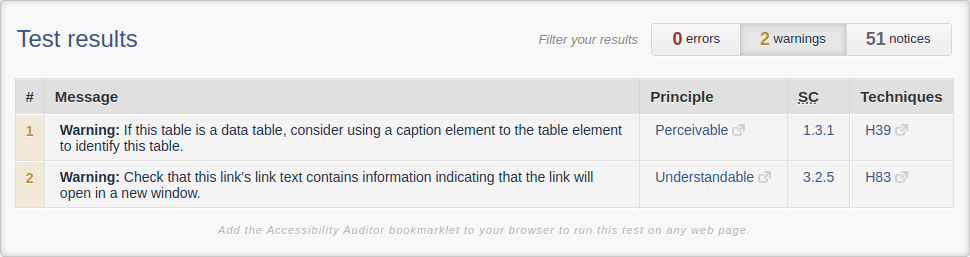

  <h1>Lessons Learned</h1>
  
A didactical project that enforces HTML/CSS abilities

  
  
  
  [Project Web Page](https://fabio-vicente.github.io/Lessons-Learned/)

  

    

      <strong>See a screenshot</strong>
    

     
    
  

 

## About

This is the first project developed on [Trybe](https://www.betrybe.com/) course.

For this one, was tested basic knowledges on HTML and CSS to create a static web page with lessons learned on the course until then.

### Development Skills

- HTML5;
- CSS3;
- Box model;
- Semantic HTML;
- CodeSniffer;
- StyleLint;
- Active learning.

 

## Getting Started

### Prerequisites

  - Web Browser compatible with HTML5 and CSS3.

 

## Usage

There is 4 ways for running this project.

#### 1. Download ZIP:
>
>  - Click on the `Code` green button at repository top;
>
>      
>
>  - Click on `Download ZIP` button;
>
>      
>  
>  - Unzip the downloaded file in a choosen directory;
>  - Enter on `Lessons-Learned-main` extracted folder;
>  - Open `index.html` file on your Web Browser.

#### 2. Clone repository via HTTPS:
>
>  - Use `https://github.com/Fabio-Vicente/Lessons-Learned.git` endpoint for clonning via HTTPS (credencials may be needed);
>  - Enter on `Lessons-Learned-main` cloned folder;
>  - Open `index.html` file on your Web Browser.

#### 3. Clone repository via SSH:
>
>  - Use `git@github.com:Fabio-Vicente/Lessons-Learned.git` endpoint for clonning via SSH (it must be need set a SSH Key);
>  - Enter on `Lessons-Learned-main` cloned folder;
>  - Open `index.html` file on your Web Browser.

#### 4. Go to project deployed Web Page:
>
>  - Go to https://fabio-vicente.github.io/Lessons-Learned/;

 

## CodeSniffer

The project code was tested by [CodeSniffer](https://squizlabs.github.io/HTML_CodeSniffer/) - acessibility standart checker, according by WCAG 2.1 Level AAA and was evaluated with no errors

### Can I request CodeSniffer report by my own?

Yes!

Copy [HTML](index.html) file content and paste on [CodeSniffer Web Page](https://squizlabs.github.io/HTML_CodeSniffer/), choose standart to be evaluated, and `Run HTML_CodeSniffer`.

 

## Authors & contributors

The original setup of this repository is by [Fábio Vicente(Me)](https://github.com/Fabio-Vicente).

 

## Acknowledgements

- [Trybe](https://www.betrybe.com/) by porpose this project and specify requirements;
- [Amazing Github Template](https://github.com/dec0dOS/amazing-github-template) which provides a Readme Template for inspiration.

 
 
 
 

